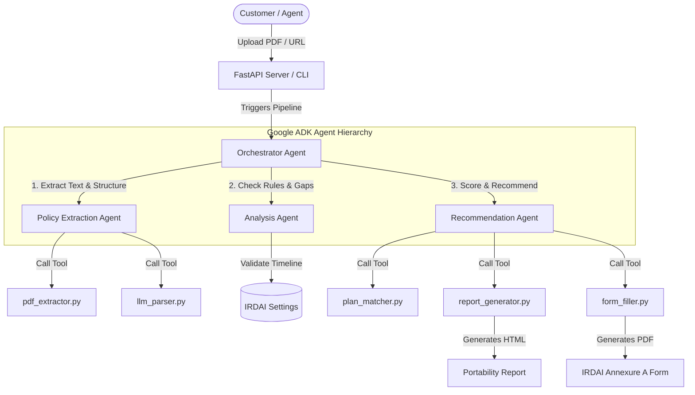

# AntiGravity — Health Insurance Portability Analyzer
**Powered by Google ADK (Agent Development Kit), FastAPI, and ReportLab**

AntiGravity is an intelligent multi-agent platform designed for **Prudential Health India** to automate the health insurance portability evaluation process. It digests competitor policies (PDFs), checks regulatory eligibility, flags coverage gaps, recommends the most optimal Prudential plan, and generates pre-filled statutory application forms (IRDAI Annexure A).

---

## 📐 Architecture & Agent Flow

AntiGravity leverages a hierarchical multi-agent architecture built on the **Google ADK**. 



---

## 🤖 Google ADK Agents & Roles

The system decouples logic into four distinct agents:

| Agent Name | ADK Config File | Role & Responsibility | Tool & Functions Utilized |
| :--- | :--- | :--- | :--- |
| **Orchestrator Agent** | `agents/orchestrator_agent.py` | Parent root agent. Acts as the controller coordinating the pipeline flow sequentially across sub-agents. | Coordinates sub-agents, formats terminal summaries. |
| **Extraction Agent** | `agents/extraction_agent.py` | Specializes in document processing. Downloads PDFs, extracts raw text, and structures it into a 25+ field schema. | `pdf_extractor.py` (pdfplumber/OCR), `llm_parser.py` (LLM/Regex fallback). |
| **Analysis Agent** | `agents/analysis_agent.py` | Enforces policy constraints. Performs IRDAI-compliant portability eligibility scoring and flags coverage gaps. | Regulatory date checks, continuous coverage scoring. |
| **Recommendation Agent** | `agents/recommendation_agent.py` | Matches applicant profile against the Prudential catalog. Suggests the best plan and triggers downstream files generation. | `plan_matcher.py` (catalogue), `report_generator.py` (JSON/HTML), `form_filler.py` (PDF). |

---

## 📂 Core Directory Structure

```
antigravity-agent/
├── agents/                     # Google ADK Agents
│   ├── orchestrator_agent.py   # Parent controller agent
│   ├── extraction_agent.py     # PDF reader & schema extractor
│   ├── analysis_agent.py       # Coverage gap & IRDAI timeline analyzer
│   └── recommendation_agent.py # Plan matcher and compiler agent
├── tools/                      # Underlying processing scripts
│   ├── pdf_extractor.py        # 3-layer PDF parser (Digital + Scanned OCR)
│   ├── llm_parser.py           # LLM parser (Claude/Gemini) + Regex fallback
│   ├── plan_matcher.py         # Prudential catalogue scoring rules
│   ├── report_generator.py     # HTML & JSON report builder
│   └── form_filler.py          # ReportLab IRDAI Annexure A PDF generator
├── data/
│   └── prudential_plans/
│       └── plans.json          # Prudential Health India product catalogue
├── frontend/
│   └── index.html              # Premium dark-theme glassmorphism Web UI
├── INPUTFILES/                 # Demo test files
│   ├── individual_health_insurance_15_page_policy.pdf
│   └── health_insurance_policy_and_portability_kit.pdf
├── api.py                      # FastAPI server & route handlers
├── main.py                     # CLI & ADK entrypoint
├── requirements.txt            # System dependencies
└── README.md                   # System documentation
```

---

## ⚙️ Setup & Installation

1. **Clone & Navigate** to the project directory.
2. **Install Dependencies**:
   ```bash
   pip install -r requirements.txt
   ```
3. **Configure Environment Variables** (Optional):
   Copy `.env.example` to `.env`. If you want to use live LLMs, insert your API keys:
   ```env
   ANTHROPIC_API_KEY=your_key_here
   GOOGLE_API_KEY=your_key_here
   ```
   *Note: If keys are missing, the system gracefully falls back to local rule-based parsing so the pipeline remains fully functional offline.*

---

## 🚀 Running the Application

### 1. The Interactive Web UI (FastAPI Server)
Launch the server to get access to both the REST API and the visual UI:
```bash
python api.py
```
*   **Web UI Address**: Open your browser to **`http://localhost:8000/app/`**
*   **API Docs (Swagger)**: View endpoints at **`http://localhost:8000/docs`**

### 2. Command Line Interface (CLI)
Run the pipeline directly on your console:
```bash
# To test the Apex policy
python main.py --pdf INPUTFILES/individual_health_insurance_15_page_policy.pdf

# To test the Portability Kit
python main.py --pdf INPUTFILES/health_insurance_policy_and_portability_kit.pdf
```

---

## 📝 Generated Output Files
All generated files are saved with timestamps in the `reports/` folder:
*   `report_<name>_<timestamp>.json`: Raw extracted fields and recommendation outputs.
*   `report_<name>_<timestamp>.html`: A beautifully styled comparison report for sharing with customers.
*   `annexure_a_<name>_<timestamp>.pdf`: A pre-filled IRDAI Annexure A portability form, styled to match the official layout.

---

## 🧪 Running Unit Tests
To verify the entire pipeline, execute the pytest suite:
```bash
python -m pytest tests/ -v
```
*All 21 unit tests covering PDF extraction, scoring, gap analysis, and ReportLab canvas generation should pass.*
